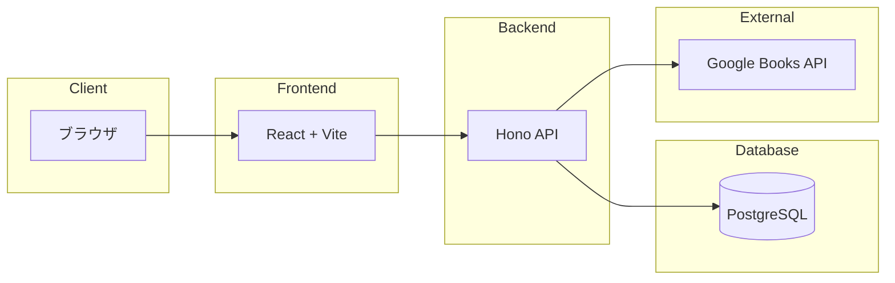

# アーキテクチャ設計書

## 1. システム構成図



## 2. 技術スタック詳細

### 2.1 フロントエンド

| 技術     | バージョン   | 選定理由 |
| -------- | ------------ | -------- |
| [技術名] | [バージョン] | [理由]   |

**主要な設定**:

- [設定項目]

### 2.2 バックエンド

| 技術     | バージョン   | 選定理由 |
| -------- | ------------ | -------- |
| [技術名] | [バージョン] | [理由]   |

**主要な設定**:

- [設定項目]

### 2.3 データベース

| 技術     | バージョン   | 選定理由 |
| -------- | ------------ | -------- |
| [技術名] | [バージョン] | [理由]   |

**主要な設定**:

- [設定項目]

## 3. 環境構成

### 3.1 Docker構成

```yaml
# docker-compose.yml
services:
  [service]:
    image: [image]
    ports:
      - "[host]:[container]"
    environment:
      - [ENV_VAR]=[value]
```

### 3.2 環境変数

| 変数名    | 説明   | 例   |
| --------- | ------ | ---- |
| [ENV_VAR] | [説明] | [例] |

### 3.3 ポート設定

| サービス   | ポート   | 用途   |
| ---------- | -------- | ------ |
| [サービス] | [ポート] | [用途] |

## 4. 依存関係

### 4.1 フロントエンド

| パッケージ   | バージョン   | 用途   |
| ------------ | ------------ | ------ |
| [パッケージ] | [バージョン] | [用途] |

### 4.2 バックエンド

| パッケージ   | バージョン   | 用途   |
| ------------ | ------------ | ------ |
| [パッケージ] | [バージョン] | [用途] |

### 4.3 共通

| パッケージ   | バージョン   | 用途   |
| ------------ | ------------ | ------ |
| [パッケージ] | [バージョン] | [用途] |

### 4.4 開発

| パッケージ   | バージョン   | 用途   |
| ------------ | ------------ | ------ |
| [パッケージ] | [バージョン] | [用途] |

## 5. パフォーマンス設計

### 5.1 キャッシュ戦略

- [キャッシュ設定]

### 5.2 最適化

- [最適化施策]

### 5.3 目標値

| 指標   | 目標値   | 施策   |
| ------ | -------- | ------ |
| [指標] | [目標値] | [施策] |

## 6. セキュリティ設計

### 6.1 アクセス制御

- [アクセス制御の仕組み]

### 6.2 入力検証

- [バリデーション方針]

### 6.3 CORS設定

- [CORS設定]

### 6.4 機密情報の管理

- [機密情報の取り扱い方針]

### 6.5 その他

- [XSS対策]
- [SQLインジェクション対策]
