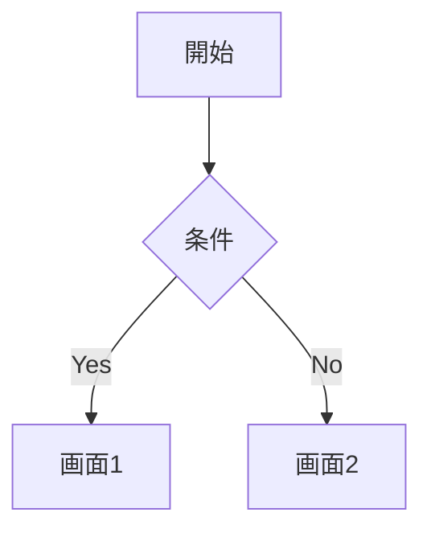

# 機能設計書

## 1. データモデル

### 1.1 ER図

```mermaid
erDiagram
    [Entity1] ||--o{ [Entity2] : [relationship]

    [Entity1] {
        string id PK
    }

    [Entity2] {
        string id PK
        string entity1Id FK
    }
```

### 1.2 モデル定義

#### [エンティティ名]

**型定義**:

```typescript
type [EntityName] = {
  id: string;
  // ...
};
```

**バリデーションルール**:

| フィールド | ルール   |
| ---------- | -------- |
| [field]    | [ルール] |

## 2. 画面仕様

### 2.1 画面一覧

| 画面名   | URLパス | 概要   |
| -------- | ------- | ------ |
| [画面名] | [/path] | [概要] |

### 2.2 画面詳細

#### [画面名]

**目的**: [画面の役割]

**UI要素**:

- [UI要素1]
- [UI要素2]

**ユーザーアクション**:

| アクション   | 結果   |
| ------------ | ------ |
| [アクション] | [結果] |

## 3. API仕様

### [HTTPメソッド] [パス]

**概要**: [APIの目的]

**リクエスト**:

```typescript
type [RequestType] = {
  // ...
};
```

**レスポンス**:

```typescript
// 成功時
type [ResponseType] = {
  // ...
};

// エラー時
type ErrorResponse = {
  code: string;
  error: string;
  message: string;
};
```

**ステータスコード**:

| コード | 説明   |
| ------ | ------ |
| [code] | [説明] |

## 4. ユーザーフロー



## 5. 外部API連携

### [API名]

**用途**: [なぜこのAPIを使うか]

**エンドポイント**:

```
[HTTPメソッド] [URL]
```

**レスポンス**:

```typescript
type [ResponseType] = {
  // ...
};
```

**エラーケース**:

| ケース   | 対応   |
| -------- | ------ |
| [ケース] | [対応] |

## 6. ビジネスルール

### [ルール名]

[ルールの説明]

| 条件   | 結果   |
| ------ | ------ |
| [条件] | [結果] |

## 7. エラーハンドリング

| エラーケース | 原因   | ユーザーへの表示 | 対応   |
| ------------ | ------ | ---------------- | ------ |
| [ケース]     | [原因] | [メッセージ]     | [対応] |
