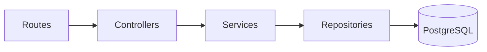
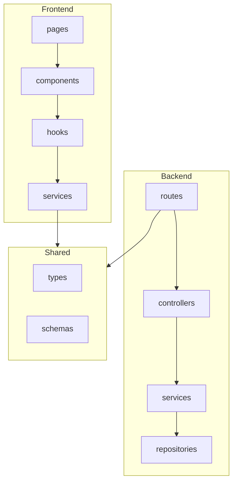

# リポジトリ構造定義書

## 1. ディレクトリ構造

```
/
├── packages/
│   ├── frontend/          # フロントエンドアプリケーション
│   │   ├── src/
│   │   │   ├── features/      # 機能ごとのモジュール
│   │   │   │   ├── books/
│   │   │   │   │   ├── components/
│   │   │   │   │   ├── hooks/
│   │   │   │   │   └── services/
│   │   │   │   └── bookshelf/
│   │   │   │       ├── components/
│   │   │   │       ├── hooks/
│   │   │   │       └── services/
│   │   │   ├── components/    # 共通コンポーネント
│   │   │   ├── hooks/         # 共通hooks
│   │   │   ├── pages/
│   │   │   └── types/
│   │   └── ...
│   │
│   ├── backend/           # バックエンドAPI
│   │   ├── src/
│   │   │   ├── routes/
│   │   │   ├── controllers/
│   │   │   ├── services/
│   │   │   ├── repositories/
│   │   │   └── types/
│   │   └── ...
│   │
│   └── shared/            # 共有モジュール
│       ├── types/
│       └── schemas/
│
├── docs/                  # ドキュメント
├── docker-compose.yml
├── package.json
└── pnpm-workspace.yaml
```

## 2. 各ディレクトリの責務

### Frontend

| パス | 責務 | 含まれるファイル |
| ---- | ---- | ---------------- |
| `features/` | 機能ごとのモジュール | 各機能のcomponents, hooks, services |
| `features/[機能名]/components/` | [責務] | [ファイル種類] |
| `features/[機能名]/hooks/` | [責務] | [ファイル種類] |
| `features/[機能名]/services/` | [責務] | [ファイル種類] |
| `components/` | 共通コンポーネント | [ファイル種類] |
| `hooks/` | 共通hooks | [ファイル種類] |
| `pages/` | [責務] | [ファイル種類] |
| `types/` | [責務] | [ファイル種類] |

### Backend

| パス | 責務 | 含まれるファイル |
| ---- | ---- | ---------------- |
| `routes/` | [責務] | [ファイル種類] |
| `controllers/` | [責務] | [ファイル種類] |
| `services/` | [責務] | [ファイル種類] |
| `repositories/` | [責務] | [ファイル種類] |
| `types/` | [責務] | [ファイル種類] |

### Shared

| パス | 責務 | 含まれるファイル |
| ---- | ---- | ---------------- |
| `types/` | [責務] | [ファイル種類] |
| `schemas/` | [責務] | [ファイル種類] |

## 3. レイヤー間データフロー

### Frontend


### Backend



## 4. ファイル命名規則

| 種類 | 規則 | 例 |
| ---- | ---- | -- |
| コンポーネント | PascalCase | `BookList.tsx` |
| hooks | camelCase + useプレフィックス | `useBooks.ts` |
| services | camelCase | `bookService.ts` |
| テスト | 対象ファイル名.test.ts | `BookList.test.tsx` |
| 型定義 | camelCase | `book.types.ts` |

## 5. モジュール間の依存関係

### 許可される依存の方向



### 依存ルール

- [依存ルール1]
- [依存ルール2]
- [依存ルール3]
