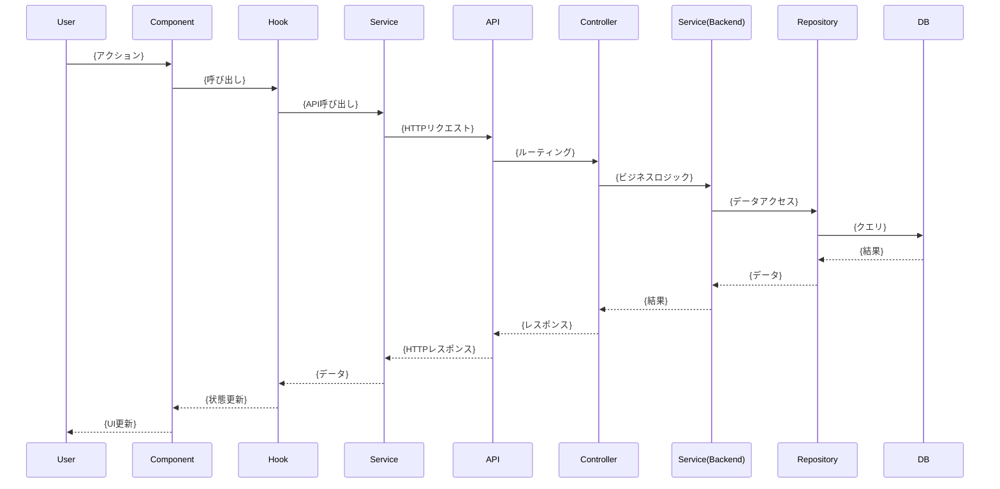

# 機能設計書: {機能名}

## 1. 機能概要

{機能の目的と概要を1-2文で説明}

## 2. 関連ドキュメント

- PRD: `docs/product-requirements.md` - {該当セクション}
- 機能設計書: `docs/functional-design.md` - {該当セクション}
- アーキテクチャ: `docs/architecture-design.md` - {該当セクション}

## 3. 実装対象

### Frontend

| ファイルパス                                                            | 種類           | 責務   |
| ----------------------------------------------------------------------- | -------------- | ------ |
| `packages/frontend/src/features/{feature}/components/{Component}.tsx`   | コンポーネント | {責務} |
| `packages/frontend/src/features/{feature}/hooks/use{Hook}.ts`           | Hook           | {責務} |
| `packages/frontend/src/features/{feature}/services/{service}Service.ts` | Service        | {責務} |

### Backend

| ファイルパス                                                  | 種類           | 責務   |
| ------------------------------------------------------------- | -------------- | ------ |
| `packages/backend/src/routes/{route}.ts`                      | ルート         | {責務} |
| `packages/backend/src/controllers/{controller}Controller.ts`  | コントローラー | {責務} |
| `packages/backend/src/services/{service}Service.ts`           | サービス       | {責務} |
| `packages/backend/src/repositories/{repository}Repository.ts` | リポジトリ     | {責務} |

### Shared

| ファイルパス                          | 種類     | 責務   |
| ------------------------------------- | -------- | ------ |
| `packages/shared/types/{type}.ts`     | 型定義   | {責務} |
| `packages/shared/schemas/{schema}.ts` | スキーマ | {責務} |

## 4. データフロー

## 5. 依存関係

### 使用する共通コンポーネント

- `components/Button.tsx` - {用途}
- `components/Input.tsx` - {用途}
- `components/Modal.tsx` - {用途}

### 使用する共通Hooks

- `hooks/useLocalStorage.ts` - {用途}

### 外部ライブラリ

- `react-hook-form` - {用途}
- `@tanstack/react-query` - {用途}

## 6. 注意点

- {注意点1}
- {注意点2}
- {注意点3}

## 7. 未決定事項

- [ ] {未決定事項1}
- [ ] {未決定事項2}
