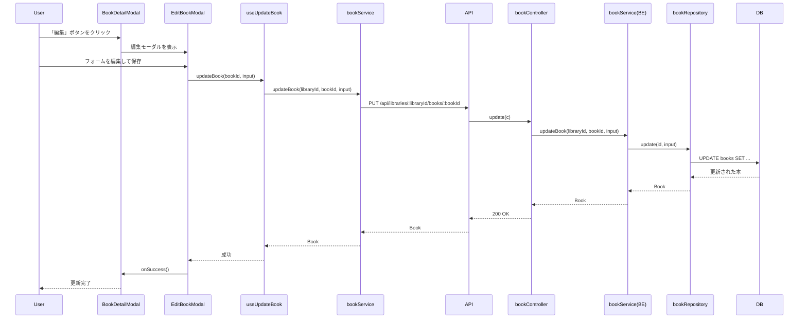
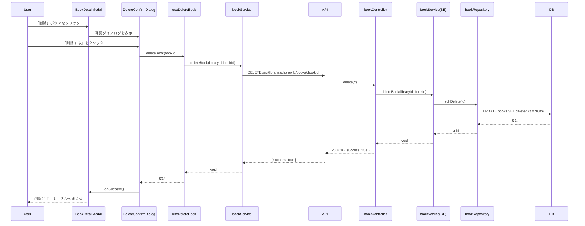

# 機能設計書: 本の編集・削除

## 1. 機能概要

本の情報（タイトル、著者、表紙画像、ページ数、カテゴリ）を編集する機能と、本を削除（ソフトデリート）する機能を実装する。

## 2. 関連ドキュメント

- PRD: `docs/product-requirements.md` - F-04: 本の編集・削除
- 機能設計書: `docs/functional-design.md` - 本の編集（モーダル）、PUT/DELETE API仕様
- アーキテクチャ: `docs/architecture-design.md` - セキュリティ設計、パフォーマンス設計

## 3. 実装対象

### Backend

| ファイルパス                                          | 種類           | 責務                        |
| ----------------------------------------------------- | -------------- | --------------------------- |
| `packages/backend/src/routes/books.ts`                | ルート         | DELETE エンドポイントを追加 |
| `packages/backend/src/controllers/bookController.ts`  | コントローラー | delete メソッドを追加       |
| `packages/backend/src/services/bookService.ts`        | サービス       | deleteBook メソッドを追加   |
| `packages/backend/src/repositories/bookRepository.ts` | リポジトリ     | softDelete メソッドを追加   |

### Frontend

| ファイルパス                                                              | 種類           | 責務                                 |
| ------------------------------------------------------------------------- | -------------- | ------------------------------------ |
| `packages/frontend/src/features/books/services/bookService.ts`            | Service        | deleteBook メソッドを追加            |
| `packages/frontend/src/features/books/hooks/useDeleteBook.ts`             | Hook           | 本の削除処理とキャッシュ更新         |
| `packages/frontend/src/features/books/components/EditBookModal.tsx`       | コンポーネント | 本の編集モーダル                     |
| `packages/frontend/src/features/books/components/EditBookForm.tsx`        | コンポーネント | 編集用フォーム（既存BookFormを拡張） |
| `packages/frontend/src/features/books/components/DeleteConfirmDialog.tsx` | コンポーネント | 削除確認ダイアログ                   |
| `packages/frontend/src/features/books/components/BookDetailModal.tsx`     | コンポーネント | 編集・削除ボタンを追加               |

## 4. データフロー

### 4.1 本の編集



### 4.2 本の削除



## 5. 依存関係

### 使用する共通コンポーネント

- `components/Modal.tsx` - EditBookModal、DeleteConfirmDialog のベース

### 使用する共通Hooks

- `useSWRConfig` - キャッシュの無効化

### 外部ライブラリ

- なし（既存のライブラリで対応可能）

### 既存コンポーネントの再利用

- `BookForm.tsx` - 編集フォームのベースとして拡張（coverImage、pageCountの編集対応）

## 6. API仕様

### DELETE /api/libraries/:libraryId/books/:bookId

**リクエスト**: なし

**レスポンス**:

```typescript
// 成功時
type DeleteBookResponse = {
  success: true;
};
```

**ステータスコード**:

| コード | 説明                           |
| ------ | ------------------------------ |
| 200    | 削除成功                       |
| 404    | 本またはマイ書庫が見つからない |
| 500    | サーバーエラー                 |

## 7. UI仕様

### EditBookModal

- BookDetailModalから「編集」ボタンで開く
- 編集可能項目: タイトル、著者、表紙画像URL、ページ数、カテゴリ
- ステータスは編集不可（BookDetailModalで変更するため）
- 保存後は自動的に閉じて詳細モーダルに戻る

### DeleteConfirmDialog

- BookDetailModalから「削除」ボタンで開く
- 確認メッセージ: 「この本を削除しますか？」
- ボタン: 「キャンセル」「削除する」
- 削除後は自動的に詳細モーダルも閉じる

### BookDetailModal の変更

- フッターに「編集」「削除」ボタンを追加
- 「閉じる」ボタンは右端に配置

## 8. 注意点

- 削除はソフトデリート（deletedAtに日時を設定）
- 削除確認ダイアログは必須
- 編集時にステータスは変更しない（既存の詳細モーダルで変更可能）
- キャッシュの無効化を確実に行う
- 編集・削除後は適切な画面に戻る

## 9. 未決定事項

なし
