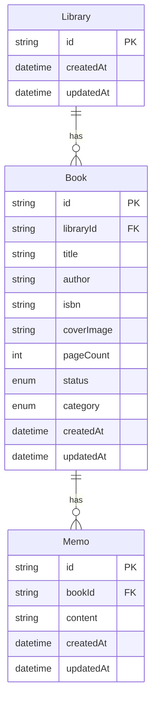
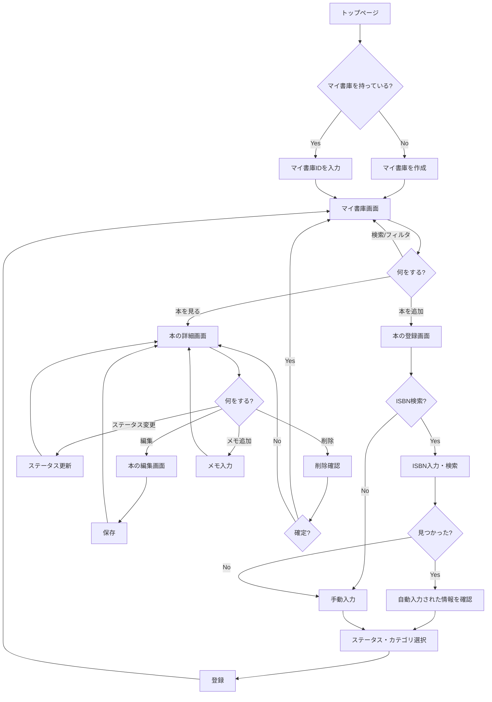

# 機能設計書

## 1. データモデル

### 1.1 ER図



### 1.2 モデル定義

#### Library（マイ書庫）

**型定義**:

```typescript
type Library = {
  id: string;
  createdAt: Date;
  updatedAt: Date;
};
```

**バリデーションルール**:

| フィールド | ルール                       |
| ---------- | ---------------------------- |
| id         | 必須、UUID形式、自動生成     |
| createdAt  | 必須、日時形式、自動設定     |
| updatedAt  | 必須、日時形式、自動更新     |

#### Book（本）

**型定義**:

```typescript
type BookStatus = 'unread' | 'wishlist' | 'completed';
type BookCategory = 'tech' | 'novel' | 'academic' | 'other';

type Book = {
  id: string;
  libraryId: string;
  title: string;
  author: string | null;
  isbn: string | null;
  coverImage: string | null;
  pageCount: number | null;
  status: BookStatus;
  category: BookCategory;
  createdAt: Date;
  updatedAt: Date;
};
```

**バリデーションルール**:

| フィールド  | ルール                                                      |
| ----------- | ----------------------------------------------------------- |
| id          | 必須、UUID形式、自動生成                                    |
| libraryId   | 必須、存在するLibraryのID                                   |
| title       | 必須、1〜200文字                                            |
| author      | 任意、1〜100文字                                            |
| isbn        | 任意、ISBN-10またはISBN-13形式                              |
| coverImage  | 任意、URL形式                                               |
| pageCount   | 任意、1〜99999の整数                                        |
| status      | 必須、'unread' \| 'wishlist' \| 'completed'                 |
| category    | 必須、'tech' \| 'novel' \| 'academic' \| 'other'            |
| createdAt   | 必須、日時形式、自動設定                                    |
| updatedAt   | 必須、日時形式、自動更新                                    |

#### Memo（メモ）

**型定義**:

```typescript
type Memo = {
  id: string;
  bookId: string;
  content: string;
  createdAt: Date;
  updatedAt: Date;
};
```

**バリデーションルール**:

| フィールド | ルール                       |
| ---------- | ---------------------------- |
| id         | 必須、UUID形式、自動生成     |
| bookId     | 必須、存在するBookのID       |
| content    | 必須、1〜10000文字           |
| createdAt  | 必須、日時形式、自動設定     |
| updatedAt  | 必須、日時形式、自動更新     |

## 2. 画面仕様

### 2.1 画面一覧

| 画面名             | URLパス                  | 概要                                   |
| ------------------ | ------------------------ | -------------------------------------- |
| トップページ       | /                        | サービス紹介、マイ書庫作成             |
| マイ書庫           | /library/:libraryId      | 本の一覧表示、ステータス別ビュー       |
| 本の登録           | /library/:libraryId/add  | ISBN検索または手動で本を登録           |
| 本の詳細           | /library/:libraryId/book/:bookId | 本の詳細表示、メモ管理         |
| 本の編集           | /library/:libraryId/book/:bookId/edit | 本の情報編集             |

### 2.2 画面詳細

#### トップページ

**目的**: サービスを紹介し、マイ書庫を作成できるようにする

**UI要素**:

- サービス紹介テキスト
- 「マイ書庫を作成」ボタン
- 既存のマイ書庫IDを入力するフォーム

**ユーザーアクション**:

| アクション                       | 結果                                         |
| -------------------------------- | -------------------------------------------- |
| 「マイ書庫を作成」ボタンをクリック | マイ書庫が作成され、マイ書庫画面に遷移       |
| マイ書庫IDを入力して送信         | 該当するマイ書庫画面に遷移                   |

#### マイ書庫

**目的**: 登録した本を状態別に表示し、管理できるようにする

**UI要素**:

- ビュー切り替えタブ（積読/読みたい/読了/すべて）
- 本の一覧表示エリア（状態に応じたユニークUI）
- 検索ボックス
- カテゴリフィルター
- 「本を追加」ボタン
- マイ書庫のURLコピーボタン

**ユーザーアクション**:

| アクション                       | 結果                                         |
| -------------------------------- | -------------------------------------------- |
| ビュータブをクリック             | 該当する状態の本のみ表示                     |
| 本をクリック                     | 本の詳細画面に遷移                           |
| 検索キーワードを入力             | タイトル・著者でフィルタリング               |
| カテゴリを選択                   | 該当カテゴリの本のみ表示                     |
| 「本を追加」ボタンをクリック     | 本の登録画面に遷移                           |
| URLコピーボタンをクリック        | マイ書庫のURLをクリップボードにコピー        |

#### 本の登録

**目的**: ISBN検索または手動入力で本を登録できるようにする

**UI要素**:

- ISBN入力フォーム
- 「検索」ボタン
- 検索結果表示エリア（タイトル、著者、表紙画像、ページ数）
- 手動入力フォーム（タイトル、著者、表紙画像URL、ページ数）
- ステータス選択（積読/読みたい/読了）
- カテゴリ選択（技術書/小説/学術書/その他）
- 「登録」ボタン
- 「キャンセル」ボタン

**ユーザーアクション**:

| アクション                       | 結果                                         |
| -------------------------------- | -------------------------------------------- |
| ISBNを入力して検索               | 書籍情報がフォームに自動入力される           |
| 検索結果がない場合               | 手動入力フォームを表示                       |
| フォームに入力して登録           | 本が登録され、マイ書庫画面に遷移             |
| キャンセルをクリック             | マイ書庫画面に戻る                           |

#### 本の詳細

**目的**: 本の詳細情報を確認し、メモを管理できるようにする

**UI要素**:

- 表紙画像
- タイトル、著者、ページ数、カテゴリ
- ステータス変更ドロップダウン
- 「編集」ボタン
- 「削除」ボタン
- メモ一覧
- メモ追加フォーム

**ユーザーアクション**:

| アクション                       | 結果                                         |
| -------------------------------- | -------------------------------------------- |
| ステータスを変更                 | 本のステータスが更新される                   |
| 「編集」ボタンをクリック         | 本の編集画面に遷移                           |
| 「削除」ボタンをクリック         | 確認ダイアログが表示される                   |
| 削除を確定                       | 本が削除され、マイ書庫画面に遷移             |
| メモを追加                       | メモが本に紐付いて保存される                 |
| メモを編集                       | メモの内容が更新される                       |
| メモを削除                       | メモが削除される                             |

#### 本の編集

**目的**: 本の情報を編集できるようにする

**UI要素**:

- タイトル入力フォーム
- 著者入力フォーム
- 表紙画像URL入力フォーム
- ページ数入力フォーム
- カテゴリ選択
- 「保存」ボタン
- 「キャンセル」ボタン

**ユーザーアクション**:

| アクション                       | 結果                                         |
| -------------------------------- | -------------------------------------------- |
| フォームを編集して保存           | 本の情報が更新され、詳細画面に遷移           |
| キャンセルをクリック             | 詳細画面に戻る                               |

## 3. API仕様

### POST /api/libraries

**概要**: 新しいマイ書庫を作成する

**リクエスト**: なし（ボディ不要）

**レスポンス**:

```typescript
// 成功時
type CreateLibraryResponse = {
  id: string;
  createdAt: string;
  updatedAt: string;
};

// エラー時
type ErrorResponse = {
  code: string;
  error: string;
  message: string;
};
```

**ステータスコード**:

| コード | 説明                   |
| ------ | ---------------------- |
| 201    | 作成成功               |
| 500    | サーバーエラー         |

### GET /api/libraries/:libraryId

**概要**: マイ書庫の情報を取得する

**リクエスト**: なし

**レスポンス**:

```typescript
// 成功時
type GetLibraryResponse = {
  id: string;
  createdAt: string;
  updatedAt: string;
};
```

**ステータスコード**:

| コード | 説明                   |
| ------ | ---------------------- |
| 200    | 取得成功               |
| 404    | マイ書庫が見つからない |
| 500    | サーバーエラー         |

### GET /api/libraries/:libraryId/books

**概要**: マイ書庫の本一覧を取得する

**リクエスト**:

```typescript
type GetBooksQuery = {
  status?: 'unread' | 'wishlist' | 'completed';
  category?: 'tech' | 'novel' | 'academic' | 'other';
  search?: string;
};
```

**レスポンス**:

```typescript
// 成功時
type GetBooksResponse = {
  books: Book[];
};
```

**ステータスコード**:

| コード | 説明                   |
| ------ | ---------------------- |
| 200    | 取得成功               |
| 404    | マイ書庫が見つからない |
| 500    | サーバーエラー         |

### POST /api/libraries/:libraryId/books

**概要**: 本を登録する

**リクエスト**:

```typescript
type CreateBookRequest = {
  title: string;
  author?: string;
  isbn?: string;
  coverImage?: string;
  pageCount?: number;
  status: 'unread' | 'wishlist' | 'completed';
  category: 'tech' | 'novel' | 'academic' | 'other';
};
```

**レスポンス**:

```typescript
// 成功時
type CreateBookResponse = Book;
```

**ステータスコード**:

| コード | 説明                   |
| ------ | ---------------------- |
| 201    | 作成成功               |
| 400    | バリデーションエラー   |
| 404    | マイ書庫が見つからない |
| 500    | サーバーエラー         |

### GET /api/libraries/:libraryId/books/:bookId

**概要**: 本の詳細を取得する

**リクエスト**: なし

**レスポンス**:

```typescript
// 成功時
type GetBookResponse = Book & {
  memos: Memo[];
};
```

**ステータスコード**:

| コード | 説明                   |
| ------ | ---------------------- |
| 200    | 取得成功               |
| 404    | 本またはマイ書庫が見つからない |
| 500    | サーバーエラー         |

### PATCH /api/libraries/:libraryId/books/:bookId

**概要**: 本の情報を更新する

**リクエスト**:

```typescript
type UpdateBookRequest = {
  title?: string;
  author?: string;
  isbn?: string;
  coverImage?: string;
  pageCount?: number;
  status?: 'unread' | 'wishlist' | 'completed';
  category?: 'tech' | 'novel' | 'academic' | 'other';
};
```

**レスポンス**:

```typescript
// 成功時
type UpdateBookResponse = Book;
```

**ステータスコード**:

| コード | 説明                   |
| ------ | ---------------------- |
| 200    | 更新成功               |
| 400    | バリデーションエラー   |
| 404    | 本またはマイ書庫が見つからない |
| 500    | サーバーエラー         |

### DELETE /api/libraries/:libraryId/books/:bookId

**概要**: 本を削除する

**リクエスト**: なし

**レスポンス**:

```typescript
// 成功時
type DeleteBookResponse = {
  success: true;
};
```

**ステータスコード**:

| コード | 説明                   |
| ------ | ---------------------- |
| 200    | 削除成功               |
| 404    | 本またはマイ書庫が見つからない |
| 500    | サーバーエラー         |

### POST /api/libraries/:libraryId/books/:bookId/memos

**概要**: メモを追加する

**リクエスト**:

```typescript
type CreateMemoRequest = {
  content: string;
};
```

**レスポンス**:

```typescript
// 成功時
type CreateMemoResponse = Memo;
```

**ステータスコード**:

| コード | 説明                   |
| ------ | ---------------------- |
| 201    | 作成成功               |
| 400    | バリデーションエラー   |
| 404    | 本またはマイ書庫が見つからない |
| 500    | サーバーエラー         |

### PATCH /api/libraries/:libraryId/books/:bookId/memos/:memoId

**概要**: メモを更新する

**リクエスト**:

```typescript
type UpdateMemoRequest = {
  content: string;
};
```

**レスポンス**:

```typescript
// 成功時
type UpdateMemoResponse = Memo;
```

**ステータスコード**:

| コード | 説明                   |
| ------ | ---------------------- |
| 200    | 更新成功               |
| 400    | バリデーションエラー   |
| 404    | メモ、本、またはマイ書庫が見つからない |
| 500    | サーバーエラー         |

### DELETE /api/libraries/:libraryId/books/:bookId/memos/:memoId

**概要**: メモを削除する

**リクエスト**: なし

**レスポンス**:

```typescript
// 成功時
type DeleteMemoResponse = {
  success: true;
};
```

**ステータスコード**:

| コード | 説明                   |
| ------ | ---------------------- |
| 200    | 削除成功               |
| 404    | メモ、本、またはマイ書庫が見つからない |
| 500    | サーバーエラー         |

### GET /api/isbn/:isbn

**概要**: ISBNで書籍情報を検索する

**リクエスト**: なし

**レスポンス**:

```typescript
// 成功時
type SearchIsbnResponse = {
  title: string;
  author: string | null;
  coverImage: string | null;
  pageCount: number | null;
  category: 'tech' | 'novel' | 'academic' | 'other' | null;
};

// 見つからない場合
type NotFoundResponse = {
  found: false;
};
```

**ステータスコード**:

| コード | 説明                   |
| ------ | ---------------------- |
| 200    | 検索成功               |
| 404    | 書籍が見つからない     |
| 500    | サーバーエラー         |

## 4. ユーザーフロー



## 5. 外部API連携

### Google Books API

**用途**: ISBNから書籍情報を取得し、入力の手間を削減する

**エンドポイント**:

```
GET https://www.googleapis.com/books/v1/volumes?q=isbn:{isbn}
```

**レスポンス**:

```typescript
type GoogleBooksResponse = {
  totalItems: number;
  items?: {
    volumeInfo: {
      title: string;
      authors?: string[];
      imageLinks?: {
        thumbnail?: string;
      };
      pageCount?: number;
      categories?: string[];
    };
  }[];
};
```

**エラーケース**:

| ケース               | 対応                                       |
| -------------------- | ------------------------------------------ |
| 書籍が見つからない   | 手動入力フォームを表示                     |
| APIエラー            | エラーメッセージを表示し、手動入力を促す   |
| タイムアウト         | リトライボタンを表示、または手動入力を促す |

## 6. ビジネスルール

### 本の状態遷移

すべての状態間で自由に遷移可能。

| 現在の状態 | 遷移可能な状態           |
| ---------- | ------------------------ |
| unread     | wishlist, completed      |
| wishlist   | unread, completed        |
| completed  | unread, wishlist         |

### カテゴリの自動設定

Google Books APIから取得したcategoriesをもとに自動マッピングする。

| APIのカテゴリ                              | 設定するカテゴリ |
| ------------------------------------------ | ---------------- |
| Computers, Technology, Programming         | tech             |
| Fiction, Literature                        | novel            |
| Science, Mathematics, Philosophy, History  | academic         |
| 上記以外、または取得できない               | other            |

### 制約

- 1つのマイ書庫に登録できる本は最大500冊
- 1冊の本に登録できるメモは最大100件
- メモの内容は最大10000文字

## 7. エラーハンドリング

| エラーケース             | 原因                         | ユーザーへの表示                       | 対応                           |
| ------------------------ | ---------------------------- | -------------------------------------- | ------------------------------ |
| マイ書庫が見つからない   | 無効なIDまたは削除済み       | 「マイ書庫が見つかりません」           | トップページへのリンクを表示   |
| 本が見つからない         | 無効なIDまたは削除済み       | 「本が見つかりません」                 | マイ書庫画面へのリンクを表示   |
| ISBN検索失敗             | APIエラーまたは書籍なし      | 「書籍情報を取得できませんでした」     | 手動入力フォームを表示         |
| バリデーションエラー     | 入力値が不正                 | 該当フィールドにエラーメッセージ       | フォームを再表示               |
| 登録上限超過             | 500冊を超えて登録しようとした | 「登録できる本の上限に達しました」     | 本の削除を促すメッセージ       |
| ネットワークエラー       | 通信障害                     | 「通信エラーが発生しました」           | リトライボタンを表示           |
| サーバーエラー           | 予期しないエラー             | 「エラーが発生しました」               | 時間をおいて再試行を促す       |
