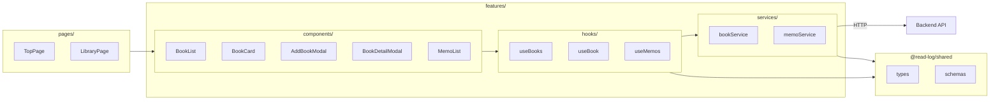
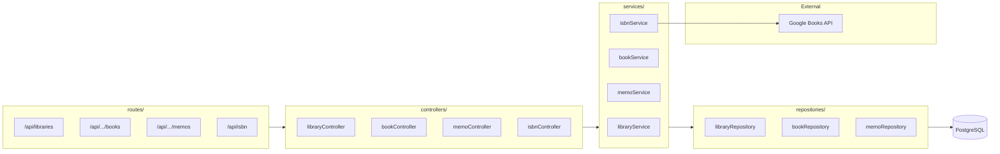
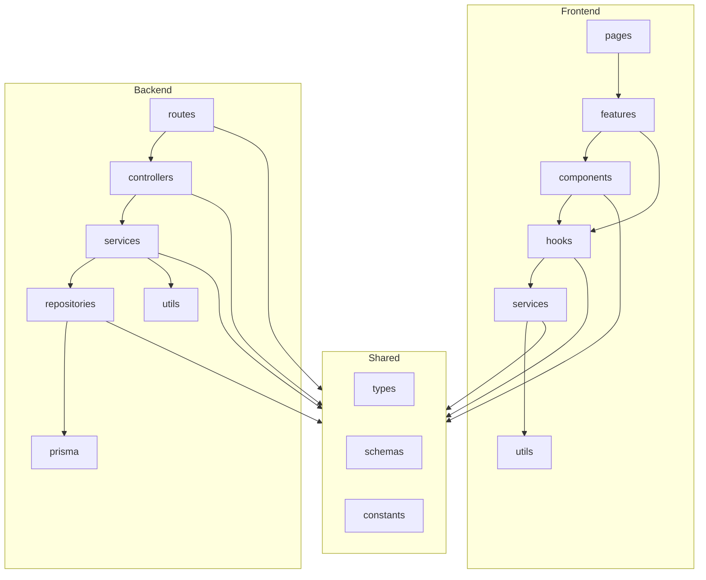

# リポジトリ構造定義書

## 1. ディレクトリ構造

```
/
├── packages/
│   ├── frontend/              # フロントエンドアプリケーション
│   │   ├── src/
│   │   │   ├── features/      # 機能ごとのモジュール
│   │   │   │   ├── library/       # マイ書庫機能
│   │   │   │   │   ├── components/
│   │   │   │   │   ├── hooks/
│   │   │   │   │   └── services/
│   │   │   │   ├── books/         # 本の管理機能
│   │   │   │   │   ├── components/
│   │   │   │   │   ├── hooks/
│   │   │   │   │   └── services/
│   │   │   │   └── memos/         # メモ機能
│   │   │   │       ├── components/
│   │   │   │       ├── hooks/
│   │   │   │       └── services/
│   │   │   ├── components/    # 共通コンポーネント
│   │   │   ├── hooks/         # 共通hooks
│   │   │   ├── pages/         # ページコンポーネント
│   │   │   ├── types/         # フロントエンド固有の型
│   │   │   ├── utils/         # ユーティリティ関数
│   │   │   ├── App.tsx
│   │   │   └── main.tsx
│   │   ├── index.html
│   │   ├── vite.config.ts
│   │   ├── tailwind.config.js
│   │   ├── tsconfig.json
│   │   └── package.json
│   │
│   ├── backend/               # バックエンドAPI
│   │   ├── src/
│   │   │   ├── routes/            # ルート定義
│   │   │   ├── controllers/       # リクエスト処理
│   │   │   ├── services/          # ビジネスロジック
│   │   │   ├── repositories/      # データアクセス
│   │   │   ├── middlewares/       # ミドルウェア
│   │   │   ├── types/             # バックエンド固有の型
│   │   │   ├── utils/             # ユーティリティ関数
│   │   │   └── index.ts
│   │   ├── prisma/
│   │   │   ├── schema.prisma
│   │   │   └── migrations/
│   │   ├── tsconfig.json
│   │   └── package.json
│   │
│   └── shared/                # 共有モジュール
│       ├── types/                 # 共有型定義
│       │   ├── library.ts
│       │   ├── book.ts
│       │   ├── memo.ts
│       │   └── index.ts
│       ├── schemas/               # zodスキーマ
│       │   ├── library.ts
│       │   ├── book.ts
│       │   ├── memo.ts
│       │   └── index.ts
│       ├── constants/             # 定数
│       │   └── index.ts
│       ├── tsconfig.json
│       └── package.json
│
├── docs/                      # ドキュメント
│   ├── ideas/
│   ├── product-requirements.md
│   ├── functional-design.md
│   ├── architecture-design.md
│   ├── repository-structure.md
│   └── development-guidelines.md
│
├── docker-compose.yml
├── package.json
├── pnpm-workspace.yaml
├── tsconfig.base.json
├── .eslintrc.js
├── .prettierrc
└── .gitignore
```

## 2. 各ディレクトリの責務

### Frontend

| パス                           | 責務                                 | 含まれるファイル                                                                                                                                        |
| ------------------------------ | ------------------------------------ | ------------------------------------------------------------------------------------------------------------------------------------------------------- |
| `features/`                    | 機能ごとにまとまったモジュール       | 各機能のcomponents, hooks, services                                                                                                                     |
| `features/library/components/` | マイ書庫に関するUIコンポーネント     | LibraryView.tsx, CreateLibraryButton.tsx                                                                                                                |
| `features/library/hooks/`      | マイ書庫のデータ取得・操作hooks      | useLibrary.ts, useCreateLibrary.ts                                                                                                                      |
| `features/library/services/`   | マイ書庫のAPI呼び出し                | libraryService.ts                                                                                                                                       |
| `features/books/components/`   | 本の管理に関するUIコンポーネント     | BookList.tsx, BookCard.tsx, BookForm.tsx, AddBookModal.tsx, BookDetailModal.tsx, EditBookModal.tsx, UnreadView.tsx, WishlistView.tsx, CompletedView.tsx |
| `features/books/hooks/`        | 本のデータ取得・操作hooks            | useBooks.ts, useBook.ts, useCreateBook.ts, useUpdateBook.ts, useDeleteBook.ts, useIsbnSearch.ts                                                         |
| `features/books/services/`     | 本のAPI呼び出し                      | bookService.ts, isbnService.ts                                                                                                                          |
| `features/memos/components/`   | メモに関するUIコンポーネント         | MemoList.tsx, MemoForm.tsx, MemoItem.tsx                                                                                                                |
| `features/memos/hooks/`        | メモのデータ取得・操作hooks          | useMemos.ts, useCreateMemo.ts, useUpdateMemo.ts, useDeleteMemo.ts                                                                                       |
| `features/memos/services/`     | メモのAPI呼び出し                    | memoService.ts                                                                                                                                          |
| `components/`                  | 複数機能で使用する共通コンポーネント | Button.tsx, Input.tsx, Modal.tsx, Loading.tsx                                                                                                           |
| `hooks/`                       | 複数機能で使用する共通hooks          | useLocalStorage.ts, useCopyToClipboard.ts                                                                                                               |
| `pages/`                       | ルートに対応するページコンポーネント | TopPage.tsx, LibraryPage.tsx                                                                                                                            |
| `types/`                       | フロントエンド固有の型定義           | router.types.ts                                                                                                                                         |
| `utils/`                       | 汎用ユーティリティ関数               | fetcher.ts, formatDate.ts                                                                                                                               |

### Backend

| パス            | 責務                                   | 含まれるファイル                                                              |
| --------------- | -------------------------------------- | ----------------------------------------------------------------------------- |
| `routes/`       | エンドポイントのルーティング定義       | libraries.ts, books.ts, memos.ts, isbn.ts, index.ts                           |
| `controllers/`  | リクエストの受け取りとレスポンスの返却 | libraryController.ts, bookController.ts, memoController.ts, isbnController.ts |
| `services/`     | ビジネスロジックの実装                 | libraryService.ts, bookService.ts, memoService.ts, isbnService.ts             |
| `repositories/` | Prismaを使用したデータアクセス         | libraryRepository.ts, bookRepository.ts, memoRepository.ts                    |
| `middlewares/`  | リクエスト処理の共通処理               | errorHandler.ts, validator.ts                                                 |
| `types/`        | バックエンド固有の型定義               | context.types.ts                                                              |
| `utils/`        | 汎用ユーティリティ関数                 | uuid.ts, categoryMapper.ts                                                    |

### Shared

| パス         | 責務                                         | 含まれるファイル                     |
| ------------ | -------------------------------------------- | ------------------------------------ |
| `types/`     | フロントエンド・バックエンドで共有する型定義 | library.ts, book.ts, memo.ts, api.ts |
| `schemas/`   | zodバリデーションスキーマ（型定義と対応）    | library.ts, book.ts, memo.ts         |
| `constants/` | 共有定数（ステータス、カテゴリ等）           | bookStatus.ts, bookCategory.ts       |

## 3. レイヤー間データフロー

### Frontend



### Backend



## 4. ファイル命名規則

| 種類           | 規則                          | 例                                         |
| -------------- | ----------------------------- | ------------------------------------------ |
| コンポーネント | PascalCase                    | `BookList.tsx`, `BookCard.tsx`             |
| hooks          | camelCase + useプレフィックス | `useBooks.ts`, `useCreateBook.ts`          |
| services       | camelCase + Service           | `bookService.ts`, `memoService.ts`         |
| controllers    | camelCase + Controller        | `bookController.ts`                        |
| repositories   | camelCase + Repository        | `bookRepository.ts`                        |
| routes         | camelCase (リソース名)        | `libraries.ts`, `books.ts`                 |
| テスト         | 対象ファイル名.test.ts(x)     | `BookList.test.tsx`, `bookService.test.ts` |
| 型定義         | camelCase                     | `book.ts`, `api.ts`                        |
| スキーマ       | camelCase (モデル名)          | `book.ts`, `memo.ts`                       |
| 定数           | camelCase                     | `bookStatus.ts`, `bookCategory.ts`         |
| ページ         | PascalCase + Page             | `TopPage.tsx`, `LibraryPage.tsx`           |
| モーダル       | PascalCase + Modal            | `AddBookModal.tsx`, `BookDetailModal.tsx`  |

## 5. モジュール間の依存関係

### 許可される依存の方向



### 依存ルール

- **上位から下位への依存のみ許可**: pages → features → components/hooks → services → utils
- **循環参照禁止**: 同一レイヤー内、または下位から上位への依存は禁止
- **sharedは全レイヤーから参照可能**: 型定義、スキーマ、定数は全パッケージから参照できる
- **features間の直接依存禁止**: features/books から features/memos への直接依存は禁止。共通化が必要な場合はsharedまたは上位のcomponents/hooksに配置
- **repositoriesはservicesからのみ呼び出し**: controllersから直接repositoriesを呼び出さない
- **外部APIはservicesレイヤーで呼び出し**: Google Books APIの呼び出しはisbnServiceで行う
